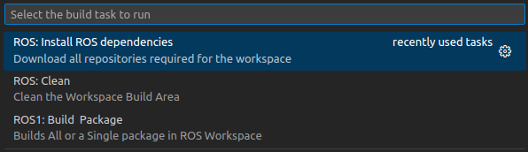
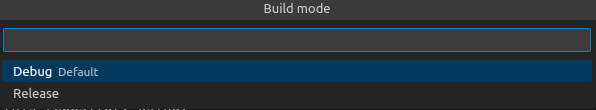

# Workspace Level Readme:

# Intent of the repository : 

1. To be a container and workspace for various packages that will be created for ENPM661 ENPM673 semester projects: for the terpbot project.

# Initial Setup for Development on PC/Laptop:

1. Install vs-code editor on your ubuntu 20.04 host OS : https://linuxize.com/post/how-to-install-visual-studio-code-on-ubuntu-20-04/
2. Install docker on your ubuntu 20.04 host OS : https://docs.docker.com/engine/install/ubuntu/
3. Please remember to follow all the steps in docker installation, and verifying it's successful installation @ https://docs.docker.com/engine/install/ubuntu/#next-steps > https://docs.docker.com/engine/install/linux-postinstall/#manage-docker-as-a-non-root-user (Step 1 2 3 4)
4. Install following extensions on your VSCode: 
    1. Docker : https://marketplace.visualstudio.com/items?itemName=ms-azuretools.vscode-docker
    2. Remote-Containers :  https://marketplace.visualstudio.com/items?itemName=ms-vscode-remote.remote-containers
5. Clone this repository using:
    > ``` git clone --recurse-submodules https://github.com/vedran97/plan-percep-ws.git ```
6. From the current working directory, cd to plan-percep-ws repo which u just cloned
7. Open a terminal in plan-percep-ws and type 
    > ``` code . ```
8. A VSCode popup should arise which says "Open folder in Container" where you choose Yes OR press F1,search for "Open Folder in Container" and execute the command
9. Now wait for the build process to finish, once it's completed, you have a fully functional ROS1 workspace with example packages
11. When the container is built for the first time, a error will popup saying "Failed to enable ROS Extension" , just choose the reload window option
10. Set up ROS dependencies using the following section

## VS Code tasks:

0. How to use this? Ans: Open this directory as a container(or not) and press "Ctrl+Shift+B" to get a drop down list of available tasks.<br>Like this: <br> 
1. "ROS:Build a Package" task -> This task lets you build a selected few, or all packages. CMake parrallelism limits have been added to prevent crashing during builds.
    1. Choose a build config:<br>
    2. Choose a package name:<br>
<br>choosing no package name, will build all packages in this directory
2. "ROS:Install ROS dependencies" task -> This task lets you install ros-deps which are mentioned in any package's package.xml file, which is included in this workspace.
3. "ROS: Clean" task -> This task cleans the workspace off all build artifacts

## Setting up ROS-Dependencies :

1. Run the VSCode task "ROS:Install ROS dependencies"

# Setup Raspberry PI for development and code build:

1. Setup github ssh on RPI.
2. Clone this repository using:
    > ``` git clone --recurse-submodules https://github.com/vedran97/plan-percep-ws.git ```
3. > ```cd plan-percep-ws```
4. > ```sudo bash ./robot-scripts/install-ros.bash $(pwd) ```
5. > ```sudo  bash ./robot-scripts/dep.bash  ```

